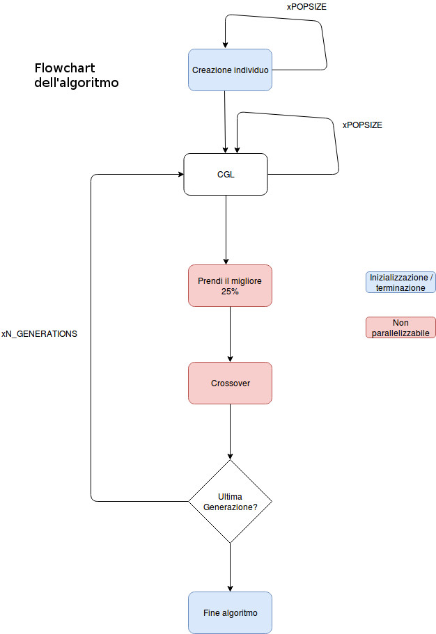
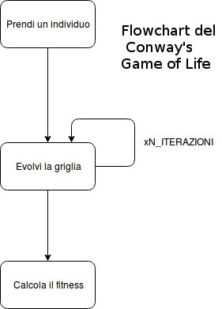
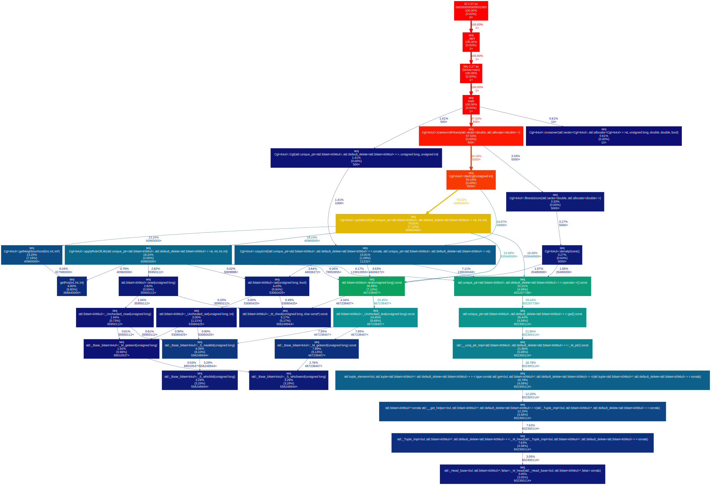
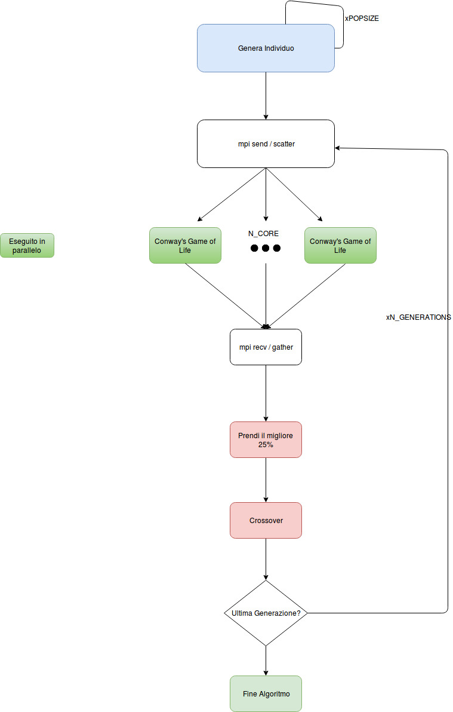
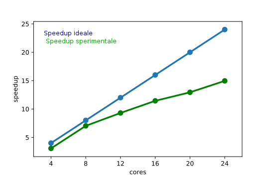
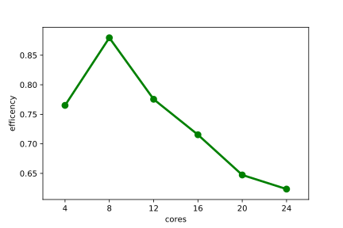

# Relazione

## Introduzione

Il progetto consiste nell'utilizzare algoritmi genetici applicati al Conway's Game of Life
(CGL). Più nel dettaglio ci proponiamo, dato uno stato finale, di trovare lo stato iniziale
della matrice CGL che permette di trovare l'approssimazione migliore del suddetto stato.

## Terminologia

* Griglia: matrice bidimensionale di bit che rappresenta lo stato del CGL durante la sua
  evoluzione. All'interno dell'algoritmo genetico rappresenta un individuo.
* Gene: Griglia all'iterazione 0, utilizzata come gene dell'algoritmo genetico.
* TODO speedup, stencil, halo swap, AG, stato finale, stato iniziale, generazione

## Definizione del problema

Il problema consiste nell'esplorare varie tecniche di parallelizzazione per
confrontare il tempo di esecuzione della versione sequenziale del nostro programma con quella
parallela. I miglioramenti ottenuti sono espressi in termini di *speedup*.

La definizione del CGL e dell'algoritmo genetico utilizzati sono oltre l'obbiettivo di
questa relazione. In appendice si presenta una breve descrizione.

Le tecniche di parallelizzazione utilizzate per la nostra analisi sono le seguenti:
* Locally synchronous computations in shared memory utilizzando la tecnica *partitioning*. Questa tecnica è implementata attraverso le API di *OpenMP*.
* Architettura master-slave con message passing utilizzando le primitive collettive (scatter,gather) e punto-punto (send,recv) di MPI.

## L'algoritmo






L'algoritmo è configurato tramite i parametri:
* POPSIZE: Numero degli individui che compongono la popolazione ad ogni iterazione dell'AG.
* N\_ITERAZIONI: Numero di iterazioni per l'evoluzione del CGL.
* N\_GENERATIONS: Numero di iterazioni per l'evoluzione dell'AG.
* DIM: Dimensione della griglia. Una griglia è composta da DIM\*DIM celle.
* SIDE: Dimensione della sottogriglia utilizzata per il calcolo del fitness (vedi...). Una
  sottogriglia è composta da SIDE\*SIDE celle.

L'algoritmo genera POPSIZE\*N\_GENERATIONS\*N\_ITERAZIONI griglie durante la sua esecuzione.
Il blocco logico CGL evolve un individuo dal gene fino allo stato finale, calcolandone il
fitness.
Una volta evoluti tutti gli individui, il 25% dei migliori ordinati per fitness decrescente
vengono considerati per il calcolo del crossover: in questo modo vengono generati i POPSIZE
individui facenti parte della successiva generazione.

L'algoritmo termina dopo aver raggiunto la generazione numero N\_GENERATIONS.

### Pseudocodice (sequenziale)

```
function SEQUENTIAL(grid <- firstgeneration, fitness <- [])
	for i <- 1 to N_GENERATIONS do
		for j <- 1 to POPSIZE do
			for k <- 1 to N_ITERAZIONI do
				evolve grid[j]
			end for
			compute fitness[j]
		end for
		sort(fitness)
		newgrid <- crossover(grid, fitness)
		grid <- newgrid
	end for
end function
```

### Metodologia

La computazione del nostro codice è divisa principalmente in due funzioni:
* `GameAndFitness` calcola un esecuzione del CGL che richiede `DIM^2*(1+N_ITERAZIONI)` e
  viene eseguito `N_GENERATIONS*POPSIZE` volte.
* `Crossover` che richiede un numero di cicli pari a `DIM^2*POPSIZE` e viene eseguito `N_GENERATIONS`
  volte.

Da questo si nota ed empiricamente si dimostra che all'aumentare della popolazione e/o
del numero di generazioni il tempo richiesto alla funzione `Crossover` è insignificante
rispetto al tempo totale. Il rapporto infatti risulta essere indipendente dal numero di
generazioni e dal numero di individui, nonchè dalla dimensione della griglia. Si può
predire che `Crossover` occuperà all'incirca l'`1%` del tempo di esecuzione del programma,
ed i risultati sperimentali confermano questa ipotesi.

## Grafo di esecuzione

La nostra implementazione genera il seguente grafo di esecuzione:


Si nota come alcuni path traggano un beneficio maggiore dalla parallelizzazione rispetto ad
altri.

Dal grafo si nota che l'evoluzione del CGL (funzione `Cgl<T>::startCgl()`) occupa circa il 94%
del tempo di esecuzione, mentre il calcolo della funzione di fitness `Cgl<T>::fitnessScore()`
solamente il 3% circa e la funzione `Cgl<T>::crossover` solo lo 0.61%. Per questo motivo ci siamo concentrati sulla parallelizzazione del CGL.

Analizzando l'evoluzione del CGL, si nota che il 74% del tempo totale viene spesa all'interno
della funzione `Cgl<T>::updateCell`, che applica le regole del Game of Life a una data cella.
Da questa osservazione presentiamo nella prossima sezione la prima tecnica di
parallelizzazione.

I parametri utilizzati per generare il grafo di esecuzione sono i seguenti:
```
DIM: 64
SIZE: 8
N\_ITERAZIONI: 20
N\_GENERATIONS: 10
POPSIZE: 50
```
Variando i parametri il grafo presenta una variazione trascurabile nelle percentuale dei
tempi di esecuzione dei metodi sopra citati.

## Partitioning in Shared memory

Il calcolo del CGL si presta a tecniche di parallelizzazione *locally synchronous*
come il *partitioning* in quanto è possibile applicare la *rule of life* utilizzando
solamente i vicini di una data cella, per ogni cella della griglia.

Questo ha permesso di suddividere ogni griglia in N partizioni che vengono lette ciascuna da un thread indipendente, i quali a loro volta calcolano il risultato sulla matrice di scrittura.
Con questa configurazione i thread lavorano in assenza di race conditions, in quanto una matrice è di sola lettura, mentre la matrice di sola scrittura è suddivisa in partizioni indipendenti assegnate esclusivamente agli N thread.

La tecnica del partitioning è stata applicata utilizzando una parallelizzazione shared
memory attraverso l'utilizzo di OpenMP.

Questa tecnica è stata applicata direttamente sull'algoritmo sequenziale ma con essa
è stato possibile implementare una parallelizzazione a due livelli, il primo in shared
memory e il secondo in message passing all'interno dell'ambiente di test distribuito.

## Message passing (MPI)

L'evoluzione di un individuo secondo la logica di `GameAndFitness` è logicamente
indipendente dall'evoluzione di tutti gli altri individui. Per questo abbiamo considerato
`GameAndFitness` come un calcolo **embarassingly parallel**. MPI ci ha permesso di
dividere l'evoluzione di una popolazione di individui tra N core fisici distribuiti su più
macchine. Al contrario, `Crossover` richidede i dati di fitness di un'intera popolazione per
ogni generazione, pertanto può essere calcolato solo da un singolo processo che deve
raccogliere i dati dai worker di `GameAndFitness`.



Per utilizzare MPI abbiamo quindi suddiviso i nostri processi in due classi:
* N slave che si occupano del calcolo di `GameAndFitness`
* 1 master che calcola `Crossover` e distribuisce i geni ottenuti dal crossover agli slave,
  di modo che essi possano calcolare la generazione successiva.

Abbiamo utilizzato 4 differenti tecniche di parallelizzazione.

### Tecniche di parallelizzazione

Abbiamo utilizzato due modelli diversi di parallelizzazione:

* Collettive: Utilizzando `scatterv` e `gatherv` abbiamo distribuito i geni ai worker
  (`scatterv`) e raccolto i risultati della funzione di fitness nel master (`gatherv`)
* Punto-punto: Il master si occupa di distribuire gli individui uno alla volta agli slaves, i
  quali lo notificano del completamento dell'evoluzione dell'individuo mandandogli il
  risultato della funzione di fitness, aspettando il successivo individuo da evolvere. Questa
  tecnica è implementata attraverso un buffer circolare con fair scheduling.

## Performance Analysis (Considerazioni)

Per eseguire l'analisi abbiamo utilizzato diverse configurazioni dei parametri sopra citati.
Inizialmente si confrontano le differenti tecniche di parallelizzazione utilizzando gli stessi parametri, successivamente si valuta lo speedup con MPI e un numero di core crescente.

### Confronto tra tecniche di parallelizzazione

Abbiamo utilizzato questa configurazione per la prima analisi:
* DIM 512
* SIDE 16
* N\_ITERATIONS 100
* POPSIZE 500
* N\_GENERATIONS 150
* N\_PARTITIONS 8
* N\_CORE 24

Abbiamo calcolato dei fattori di speedup preliminari confrontando il tempo di esecuzione
dell'algoritmo sequenziale con i tempi di esecuzione degli algoritmi paralleli. Lo speedup
factor è stato calcolato sul cluster `paradigm`, che fornisce 24 core, tramite la
seguente formula:

```
ts = tempo di esecuzione sequenziale
tp = tempo di esecuzione con p processori

s(p) = ts / tp
```
| SHM (partitioning) | MPI only | MPI only (collectives) | MPI + partitioning  | MPI + partitioning (collectives) |
|:--------------------:|:----------:|:----------------------:|:---------------------:|:--------------------------------:|
|          5         |    14    |           10           |          7          |                 5                |

Si può vedere come la tecnica che ottiene il rapporto migliore, su questa configurazione, è il message passing con MPI, senza collettive. Pertanto il calcolo dello speedup variando il numero di core utilizzati sarà effettuato utilizzanto questa tecnica.

### Variazione del numero di core

#### Speedup

Il calcolo dello speedup al variare del numero di core utilizzati è stato effettuato
utilizzando la configurazione di default mostrata sopra.

Mostriamo di seguito il grafico dello speedup calcolato alla variazione del numero di cores
utilizzati, assieme al linear speedup teorico.



#### Efficienza

Mostriamo il grafico dell'efficienza al variare del numero di cores, definita come:

```
p = num. cores
efficiency = speedup(p) / p
```



Si nota come l'esecuzione con 8 cores mostra un'efficienza molto vicina all'ideale, mentre
aumentando il numero di cores si presenta un'efficienza decrescente.
Questo risultato può essere spiegato analizzando come OpenMPI implementa la comunicazione.
Nel caso in cui tutti i processi sono istanziati sulla stessa macchina, la comunicazione
avviene in **shared memory**, mentre se i processi sono istanziati su macchine in LAN, la
comunicazione ha un overhead maggiore a causa della comunicazione in rete.

## Conclusioni

L'utilizzo di C++ e in particolare delle data structure utilizzate per gestire la
griglia in memoria (`std::bitset`), ha portato i seguenti vantaggi:
* Minore consumo in memoria
* Facilità di implementazione

Questo ha portato però i seguenti svantaggi:
* No native implementation di `std::bitset` in CUDA
* No copy on write (CoW)

# Appendice

## Algoritmi Genetici

Gli algoritmi genetici sono algoritmi euristici di ricerca e ottimizzazione che si ispirano alla teoria dell'evoluzione di Darwin.  

Un tipico algoritmo genetico parte da un certo numero di possibili soluzioni generate casualmente (individui) chiamate popolazione e provvede a farle evolvere nel corso dell'esecuzione: a ciascuna iterazione, esso opera una selezione di individui della popolazione corrente, impiegandoli per generare nuovi individui della successiva popolazione. Tale successione di generazioni evolve verso una soluzione ottima del problema assegnato.

Il gene di ogni individuo viene analizzato attraverso una funzione chiamata funzione di *fitness*. Gli individui con valore della funzione di fitness piu` alta hanno hanno quindi maggiori possibilità di sopravvivere e riprodursi. Nel nostro progetto la funzione di fitness e` costituita da una prima evoluzione del gene attraverso il Conway's Game of Life e il calcolo della distanza di Manhattan della griglie ottenute nelle ultime dieci generazioni rispetto all'obbiettivo desiderato.

L'evoluzione delle popolazioni viene ottenuta attraverso una parziale ricombinazione delle soluzioni, ogni individuo trasmette parte del suo patrimonio genetico ai propri discendenti, e l'introduzione di mutazioni casuali nella popolazione di partenza, sporadicamente quindi nascono individui con caratteristiche non comprese tra quelle presenti nel corredo genetico della specie originaria.
Tale ricombinazione viene chiamata *crossover* e puo` essere implementato attraverso differenti tecniche. Nel nostro caso il gene rappresentato da un'array di bit viene scisso in 4 parti di equa lunghezza: il gene del figlio sara` costituito dalla prima parte del padre, seconda della madre, terza del padre e quarta
 della madre.

Alla fine ci si aspetta di trovare una popolazione di soluzioni che riescano a risolvere adeguatamente il problema posto. Non vi è modo di decidere a priori se l'algoritmo sarà effettivamente in grado di trovare una soluzione accettabile. Di norma gli algoritmi genetici vengono utilizzati per problemi di ottimizzazione per i quali non si conoscono algoritmi di complessità lineare o polinomiale.

Pseudocodice:

```
for i <- 1 to POPSIZE
	population[i] <- random(gene)		
endfor
for cnt <- 1 to N_GENERATIONS
	for i <- 1 to POPSIZE
		fitness[i]  <- compute_fitness(population[i])		
	endfor
	for i <- 1 to POPSIZE
		mutation_prob = random()
		if mutation_prob > mutation_threshold
			new_population[i] = random(gene)
		else
			parent1 = take_random(population)
			survive_prob = random()
			if survive_prob > survive_threshold:
				new_population[i] = parent1
			else
				parent2 = take_random(population - parent1)
				new_population = crossover(parent1, parent2)
			endif
		endif
	endfor
	population = new_population
endfor
```

## Conway's Game of Life

Il Conway's Game of Life e` un automa cellulare la cui evoluzione e` determinata dallo stato iniziale.
Lo stato iniziale e` definito da una griglia, chiamata *mondo*, dove ogni cella e` definita da uno stato booleano di vita / morte ed ha 8 celle adiacenti.
Il mondo evolve in tempi discreti dove lo stato di ogni cella e` calcolato a partire dallo stato precedente della cella e dei suoi vicini, secondo queste regole:
- qualsiasi cella viva con meno di due celle vive adiacenti muore, come per effetto d'isolamento;
- qualsiasi cella viva con due o tre celle vive adiacenti sopravvive alla generazione successiva;
- qualsiasi cella viva con più di tre celle vive adiacenti muore, come per effetto di sovrappopolazione;
- qualsiasi cella morta con esattamente tre celle vive adiacenti diventa una cella viva, come per effetto di riproduzione;

Vi sono configurazione del Conway's Game of Life per cui la griglia evolve indefinitivamente senza che la vita nel mondo si estingua.
